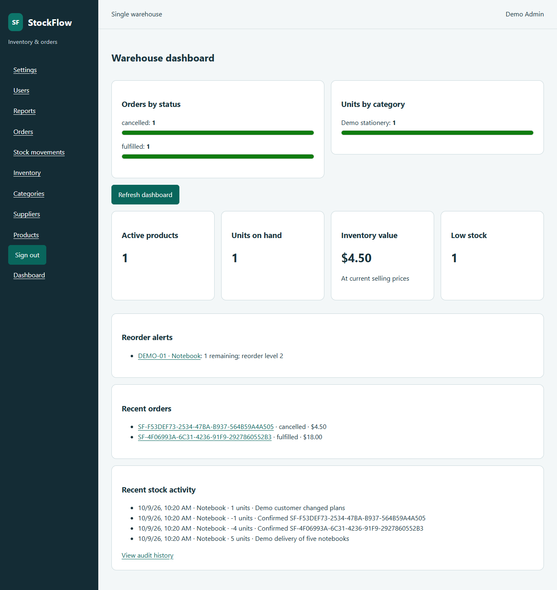

# StockFlow — Inventory & Order Management

An Angular and Node.js inventory management system with MongoDB, REST APIs, order processing, stock validation and role-based access control. All catalog records, stock, orders, reports and user preferences persist in MongoDB.



## Implemented features

- Admin/staff login with hashed opaque sessions, logout, expiry handling, server-side permissions and protected Angular routes.
- Products with unique normalized SKUs, integer-cent prices, category/supplier assignment, search, filters, sorting, pagination, editing and soft deactivation; category/supplier management preserves history.
- Transactional receipts and admin adjustments, required reasons, actor audit, movement filters, low/out-of-stock indicators and reorder thresholds.
- Multi-product editable drafts with server totals; confirmation captures current prices and deducts stock once; admin fulfillment deducts nothing further; eligible cancellation restores confirmed stock once.
- Transaction rollback, conditional stock predicates, version guards and unique ledger constraints tested against real competing requests.
- Live dashboard and charts, inventory valuation/low-stock/order/movement reports, filtered formula-safe CSV downloads.
- Admin user management, persisted name/page-size preferences, accessible labels/focus, responsive layout and loading/error/empty states.
- Non-destructive seed, complete OpenAPI contract, architecture docs, CI and real browser screenshots/video.

## Run locally on Windows

Requirements: Node.js 22.13 or newer supported Node 22 release, npm 10+, MongoDB 8.0 and Google Chrome for browser tests. Run commands from this existing repository.

```powershell
npm ci
if (-not (Test-Path .env)) { Copy-Item .env.example .env }
```

Start isolated MongoDB on 27018. The script defaults to the installed MongoDB 8.0 executable and stores data/logs in ignored `tools/mongodb/`. It leaves the separate Windows service on 27017 untouched:

```powershell
.\scripts\start-mongo.ps1
# If needed: .\scripts\start-mongo.ps1 -MongoExecutable 'C:\path\to\mongod.exe'
npm run db:init
node scripts/check-replica.mjs
```

If the project replica set is already running, skip starting another process. Default URI: `mongodb://127.0.0.1:27018/stockflow?replicaSet=rs0&directConnection=true`. Standalone MongoDB is refused. Keep port 27018 local.

On an **empty** local database, seed six products, three categories, two suppliers, admin/staff accounts and four orders in different lifecycle states:

```powershell
npm run seed
```

The seed refuses nonempty databases and is restricted to local development MongoDB on 27018. This workstation's existing `.env` selects the already-seeded `StockFlow-Inventory-Order-Management-System` database; preserve that file and start the app directly here. Fresh example configuration defaults to `stockflow`. For an unseeded local setup, `npm run provision:admin --workspace @stockflow/api` creates an admin using `ADMIN_EMAIL`, `ADMIN_NAME` and `ADMIN_PASSWORD` (at least twelve characters). Provisioning refuses production and existing accounts.

Start API and Angular in two terminals:

```powershell
# Terminal 1
npm run dev:api
# Terminal 2
npm run dev:client
```

Open **http://localhost:4200**. API: http://localhost:3000/api/health. Angular proxies `/api`; writes require `APP_ORIGIN=http://localhost:4200`.

| Demo account | Email                | Password           |
| ------------ | -------------------- | ------------------ |
| Admin        | admin@stockflow.test | StockFlowDemo!2026 |
| Staff        | staff@stockflow.test | StockFlowDemo!2026 |

These are public development credentials. `DEMO_PASSWORD` can replace the seed password before first seeding. Do not seed production or reuse this password for real users.

### Docker database alternative

Use Docker **instead of** local mongod on 27018:

```powershell
docker compose up -d --wait
npm run db:init
node scripts/check-replica.mjs
npm run seed
```

Compose defines MongoDB 8.0 with rs0, a persistent volume, loopback port mapping and primary health check. **Local Docker execution remains blocked:** Docker Desktop is absent; the user approved local MongoDB. [Successful Linux CI](https://github.com/bhavikmithaiwala/StockFlow-Inventory-Order-Management-System/actions/runs/37944373998) independently verified Compose health and real transactions, plus all build/backend/Angular/E2E/production-browser checks. YAML validation alone does not establish container startup.

Compiled full-stack startup is documented in [PRODUCTION.md](docs/PRODUCTION.md). `node scripts/check-production.mjs` verifies the built application in a real browser on an isolated database.

## Actual workflow evidence

[Watch the recorded browser workflow](docs/demo/stockflow-workflow.webm). [Orders](docs/screenshots/orders.png), [stock movements](docs/screenshots/movements.png) and [inventory report](docs/screenshots/reports.png) screenshots are captured by the real Playwright test.

The recording creates a category, supplier and Notebook (450 cents), receives five units, confirms and fulfills a four-unit order, then confirms and cancels a one-unit order. Final stock is one, valuation is $4.50 and the audit trail contains one receipt, two deductions and one restoration. CSV download and staff restrictions are tested too. This isolated one-product E2E fixture differs from the six-product development seed. Screenshots and dashboard numbers come from actual app activity.

For a manual demo, log in as admin, create a new category/supplier/product, receive five units with a reason, draft four units, confirm, inspect movements, fulfill and verify stock remains one. Confirm and cancel another one-unit order with a reason: stock returns to one. Log in as staff to demonstrate Users/adjustment/fulfillment restrictions. Run the concurrency suite to demonstrate competing confirmations without overselling.

## Verify

The replica set must be running. Tests use unique guarded databases rather than resetting the development seed. Stop existing API/frontend instances before E2E, which starts its own servers.

```powershell
npm run lint
npm run format:check
npm run typecheck
npm run build
node scripts/check-openapi.mjs
node scripts/check-ci.mjs
node scripts/check-replica.mjs
npm run test:unit --workspace @stockflow/api
npm run test:api --workspace @stockflow/api
npm run test:concurrency --workspace @stockflow/api
npm test --workspace @stockflow/api
$env:CHROME_BIN = 'C:\Program Files\Google\Chrome\Application\chrome.exe'
npm test --workspace @stockflow/client
npx playwright install ffmpeg
npm run test:e2e
npm audit --omit=dev
```

Final local release checks: **55 backend tests** (8 unit + 47 API/integration, including 3 dedicated concurrency cases), **10 Angular ChromeHeadless tests**, **2 Playwright workflows**, clean install, lint/format/typecheck, both production builds, real transaction commit/rollback and the compiled full-stack production browser probe passed. [PROGRESS.md](docs/PROGRESS.md) records verification and blockers. GitHub Actions runs these principal checks and retains evidence; local results do not assert a remote CI pass.

## Design decisions and limitations

[Architecture, database indexes and RBAC](docs/ARCHITECTURE.md), [API examples](docs/API.md) and [OpenAPI](docs/openapi.json) document implementation. Confirmation/cancellation use replica-set transactions, bounded retries, conditional quantities and order state/version predicates; fulfillment changes only the order. Price snapshots preserve confirmed history. Sessions supply trusted roles/actor IDs. Client-provided stock quantities or order totals cannot override stored values.

The UI displays USD and values stock at selling price, not purchase cost. CSV caps at 10,000 rows; concurrently changing reports are not financial snapshots. Admin accounts cannot be demoted/deactivated to prevent lockout. No password-reset, multi-tenancy or high-availability deployment is included. Production needs HTTPS, authenticated/restricted MongoDB, backups, explicit origin and shared rate limiting for multiple API processes. No cloud deployment was performed.

Runtime dependency audit passed with zero findings. Six development-only high findings remain through Karma/braces, with no patched braces release available at verification; critical test-worker findings were removed by upgrading Vitest. See [dependency verification](docs/DEPENDENCIES.md).

Work follows the meaningful [65-step roadmap](docs/COMMIT_ROADMAP.md) with additional architecture/security corrections. Existing history is preserved and new commits use actual development dates. [Commit inventory](docs/COMMITS.md) records incremental hashes and dates. Obtain the complete current report with `node scripts/commit-report.mjs`, or:

```powershell
git log --reverse --format='%h %aI %s' 09b8d2c..HEAD
git rev-list --count 09b8d2c..HEAD
```
