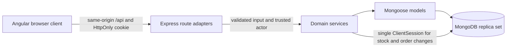
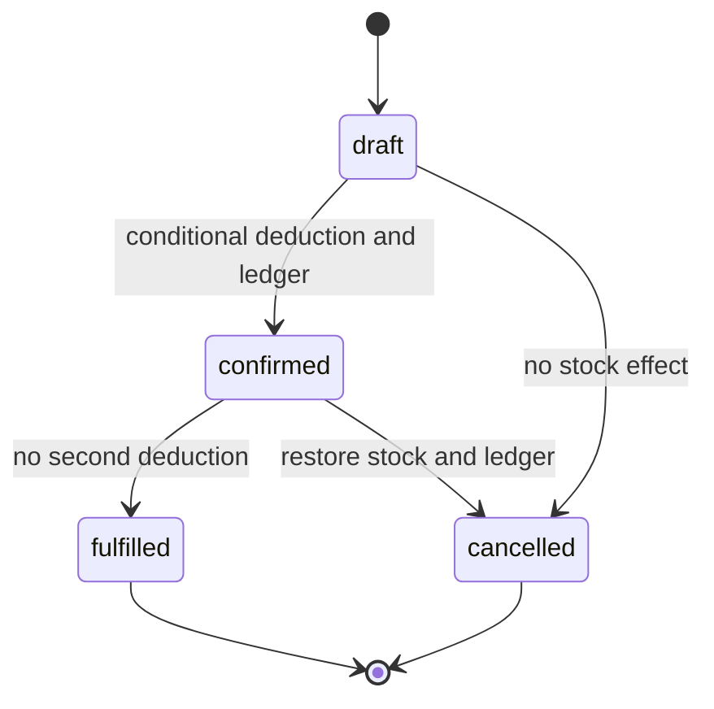

# Architecture and consistency

StockFlow is an npm workspace with an Angular standalone TypeScript client (`apps/client`), Express TypeScript API (`apps/api`) and MongoDB replica set. Angular reactive forms and signals call the same real API used by integration tests. Route adapters validate inputs, enforce authentication/roles and serialize results. Domain services own persistence and transactions; Mongoose models own schema constraints and indexes. Query schemas are shared by lists and reports. There is no mock data source in the application.

## Persistent model

| Collection     | Relationships and important constraints                                                                                                                                                                              |
| -------------- | -------------------------------------------------------------------------------------------------------------------------------------------------------------------------------------------------------------------- |
| Users          | Unique normalized email; scrypt password hash excluded by default; admin/staff, active flag, page-size preference                                                                                                    |
| Sessions       | User reference; unique SHA-256 token hash; expiry TTL index; last-used timestamp; raw tokens never stored                                                                                                            |
| Categories     | Unique normalized name; active flag; timestamps                                                                                                                                                                      |
| Suppliers      | Contact fields; active/name index; timestamps                                                                                                                                                                        |
| Products       | Unique normalized SKU; category and supplier references; integer cents, bounded nonnegative quantity/reorder level; active/category/name and active/supplier indexes                                                 |
| Orders         | Unique UUID-based order number; product/name/SKU/price line snapshots; server total, creator, actor history and status timestamps; status/date and creator/date indexes                                              |
| StockMovements | Product, actor and optional order references; type, signed delta, before/after quantities, reason and immutable creation time; product/date and type/date indexes; partial unique `(orderId, productId, type)` index |

Catalog references must exist and be active when assigning them. Product creation starts at quantity zero. Catalog deactivation preserves historical references. Category/supplier reference checks and deactivation use transactional version guards to avoid creating a product against a concurrently deactivated reference. SKU normalization removes whitespace and uppercases; category uniqueness collapses whitespace and lowercases. Database unique indexes resolve racing duplicate requests.

Money is integer cents, never a floating-point amount supplied as an order total. The UI displays USD. Inventory valuation multiplies current selling price by quantity; it is not cost accounting. Individual products cap price at 100,000,000 cents and quantity at 1,000,000; order/report aggregates reject unsafe integer totals.

## Stock and order invariants

Receipts and adjustments atomically update a product and append the corresponding ledger entry. Conditional updates bound quantity to 0–1,000,000. Reasons and trusted server-side actor IDs are required. A ledger insertion failure aborts the quantity update.

Draft creation/edit calculates current price snapshots without reserving stock. Editing matches the draft status and version to detect concurrent changes. Confirmation locks the draft order version, then processes products in canonical ID order. Each decrement matches an active product with `quantity >= requested quantity`. It snapshots current name/SKU/price, inserts negative movements and records confirmed status/history inside the same transaction. Insufficient stock on any line rolls back every earlier deduction, all movements and the order update.

Fulfillment conditionally changes a confirmed order to fulfilled and records its actor/time without a second stock deduction. Draft cancellation only updates the order. Confirmed cancellation restores quantities, appends positive movements and records status/reason/history in one transaction, including for a subsequently inactive product. Capacity failure aborts the complete cancellation. Fulfilled and cancelled orders are terminal.

Each transaction uses one session with snapshot reads and majority writes. Operations within that session are sequential. The driver retries transaction conflicts; the wrapper bounds callback attempts to five, total transaction time to 20 seconds and commit time to five seconds. Repeated lifecycle requests return a 409 conflict and never repeat stock effects. This is effect idempotency, not an HTTP idempotency-key replay cache. Order status/version predicates and the unique order-product-movement index provide separate defenses.

A standalone MongoDB instance is refused at startup. Local verification uses a real MongoDB 8.0 `rs0` primary on 27018. The existing Windows service on 27017 is untouched. Single-node replication enables transaction testing but provides no high availability. Ledger model update/delete operations are blocked and no ledger mutation endpoint exists; a privileged direct database connection can bypass application rules and must be restricted in a deployment.

## Authentication and authorization

Login verifies salted scrypt (`N=131072`, `r=8`, `p=1`) and creates a cryptographically random opaque cookie. Only its SHA-256 hash is stored. Cookies are HttpOnly, SameSite Strict, scoped to `/api`, eight hours, and Secure in production. Requests check expiry and the current user's active flag; logout deletes the session. MongoDB TTL cleanup is supplementary, not the expiry enforcement. Passwords, tokens and request bodies are omitted from logs.

| Operation                                           | Admin | Staff |
| --------------------------------------------------- | ----- | ----- |
| Read catalog, inventory, orders, reports, dashboard | Yes   | Yes   |
| Create/edit/deactivate catalog                      | Yes   | No    |
| Receive stock                                       | Yes   | Yes   |
| Adjust stock with reason                            | Yes   | No    |
| Create/edit drafts, confirm, cancel eligible orders | Yes   | Yes   |
| Fulfill confirmed order                             | Yes   | No    |
| List/create/edit users                              | Yes   | No    |
| Edit own name and preferences                       | Yes   | Yes   |

Every permission is enforced by the API; navigation and Angular guards are supplementary. Staff cannot escalate role using profile input. Admin accounts cannot be demoted/deactivated to prevent account lockout. Login is limited to ten attempts per IP per fifteen minutes in one API process. All writes require the exact configured Origin, including login. Helmet supplies security headers; JSON is capped at 64 KiB; strict schemas reject unknown fields and write query parameters. Errors expose stable codes and a request ID; structured access logs omit inputs/secrets.

## Verification and operational limits

[`concurrency.test.ts`](../apps/api/src/concurrency.test.ts) sends real competing API requests against separate drafts for the final unit: exactly one confirmation succeeds, one conflicts, quantity reaches zero, and exactly one confirmation movement exists. Additional tests prove complete multi-product rollback and simultaneous cancellation restoring stock once. Inventory/order tests also cover ledger failures, duplicate lifecycle actions, inactive products, capacity bounds and price preservation. Tests create isolated `stockflow_test_*` databases with guarded cleanup. Playwright uses its own `stockflow_e2e_*` database and real admin/staff sessions.

Reports are filtered/paginated MongoDB reads. CSV exports cap at 10,000 rows and neutralize spreadsheet formulas. Separate report/dashboard reads can observe changes between queries; they are operational summaries rather than a point-in-time financial statement. CSV paging during concurrent writes has the same limitation.

Docker execution is blocked on this workstation because Docker Desktop is absent; the user approved local MongoDB verification. CI is configured to exercise Compose on a Linux runner, but a local pass does not establish a remote CI pass. Production operation needs HTTPS, restricted authenticated MongoDB, backups, an explicit origin and a shared rate-limit store when using multiple API replicas. No cloud deployment or production credentials were created. Password reset, multi-tenant ownership, purchase-cost accounting and high-availability operations are outside this implementation.
